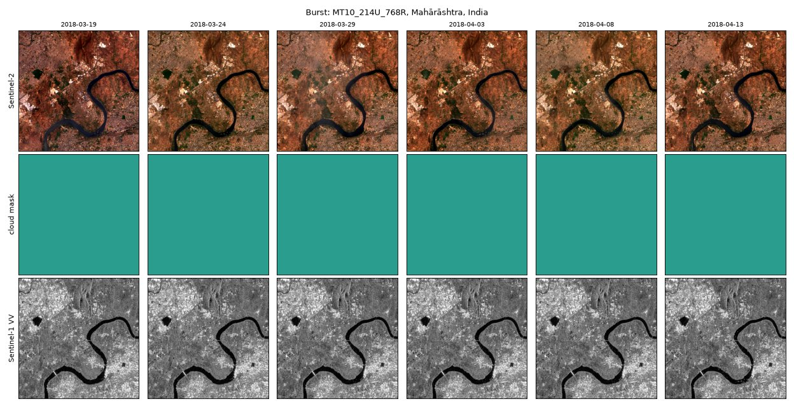
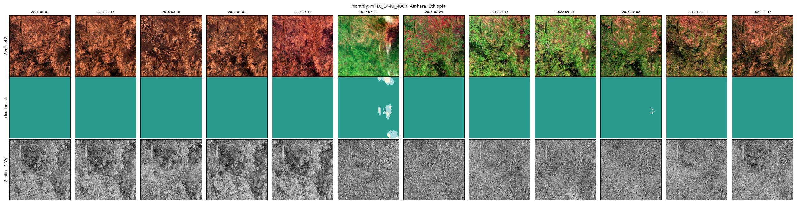
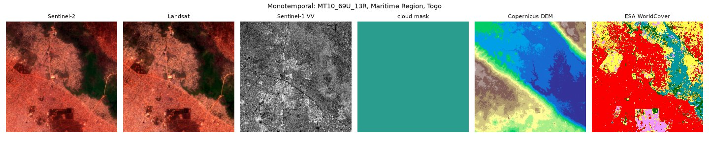

# majortom-elliot-tasks

Vision-language tasks over [Major TOM ELLIOT-Pretrain](https://source.coop/major-tom/elliot-pretrain).

For each 10.56 km tile the package measures a **fact sheet** (land cover, spectral
indices, thermal, radar, terrain, cloud, weather, named OpenStreetMap features), and
from it generates **captions** and **16 task families** (grounding, grids, counts,
phenology, change), with **scorers** and a **PyTorch dataset**. Tasks are built on the
fly, with new wording every epoch, and only from the modalities the model is given.



## Data

Everything is in one place, [source.coop/major-tom/elliot-pretrain](https://source.coop/major-tom/elliot-pretrain):

| Part | Tiles | Acquisitions per tile |
|---|---:|---|
| `monotemporal` | 250,000 | 1 |
| `monthly` | 12,500 | 12, one per calendar month, across years |
| `burst` | 16,666 | 6, about five days apart |

Each tile holds, on one 10 m grid:

| Layer | Source |
|---|---|
| Sentinel-2 L1C, 13 bands | ESA Copernicus |
| Landsat 8/9, 11 bands | USGS |
| Copernicus DEM | ESA / TanDEM-X |
| ESA WorldCover | ESA |
| Sentinel-1 RTC (VV, VH), one per Sentinel-2 frame | Catalyst, via Microsoft Planetary Computer |
| cloud and shadow mask, one per Sentinel-2 and Landsat frame | OmniCloudMask |
| ERA5 weather at each acquisition | Copernicus Climate Change Service |
| OpenStreetMap features and administrative units | © OpenStreetMap contributors |





The figures are drawn with `taco.ml` by [`docs/make_figures.py`](docs/make_figures.py).

`facts/` beside the parts holds every tile's precomputed fact sheet, series facts and
grids, so tasks and captions can be built without reading a pixel.

Licence: CC-BY-SA-4.0, except the OpenStreetMap files (`osm.parquet`, `admin.parquet`)
and `facts/`, which contains OpenStreetMap names and geometries: ODbL-1.0.

## Install

```bash
pip install "majortom-elliot-tasks[torch] @ git+https://github.com/elliot-project/majortom-elliot-tasks"
```

Python 3.12+. The data are read with the TACO reader from
[OscarPellicer/taco](https://github.com/OscarPellicer/taco), which pip builds from
source: it needs a C++23 compiler, CMake, Ninja, pkg-config, libcurl 7.83 or newer and
OpenSSL 3 or newer (on Ubuntu: `apt install build-essential cmake ninja-build pkg-config
libcurl4-openssl-dev libssl-dev`; set `CC`/`CXX` if the default compiler is older).

## Get the data

Streaming needs no download; files are cached under `~/.cache/elliot-tasks` as they
are read:

```python
import elliot_tasks as et
et.configure(elliot='https://data.source.coop/major-tom/elliot-pretrain')
```

Or download the parts you need (see the [Source Cooperative page](https://source.coop/major-tom/elliot-pretrain))
and point at the local copy:

```python
et.configure(elliot='/data/elliot-pretrain')
```

The root can also be given as `ELLIOT_ROOT`. When the root holds `facts/`, the package
uses it automatically; `et.configure_facts(path)` or `ELLIOT_FACTS` point elsewhere.
Text-only use needs only the facts:

```python
et.configure_facts('https://data.source.coop/major-tom/elliot-pretrain/facts')
t = et.facts('monthly', 352)                       # no pixel is read
et.examples_for(facts=t, available={'s2', 'dem'})
```

## Use

```python
tile = et.find('284D_496L')                # by cell, or et.tile('monthly', 352)
sheet = et.fact_sheet(tile)
print(sheet.text({'s2', 'dem'}))           # the facts S2 and the DEM support

from elliot_tasks import caption
print(caption.caption(sheet, seed=0))      # a rule-based caption; the seed picks the wording

for ex in et.examples_for(tile, available={'s2', 's1', 'dem'}, epoch=0):
    print(ex.family, '|', ex.question, '->', ex.target)
score = et.score(ex, model_answer)         # 0 to 1
```

```python
from torch.utils.data import DataLoader
from elliot_tasks.torch import ElliotTaskDataset, collate

ds = ElliotTaskDataset('monthly', available=('s2', 's1', 'dem'))
loader = DataLoader(ds, batch_size=4, num_workers=4, collate_fn=collate)
for epoch in range(3):
    ds.set_epoch(epoch)
    for arrays, conversations in loader:
        ...
```

`available` sets both the arrays loaded and the tasks asked: a model given only S2
and the DEM is never asked about radar or thermal. Arrays are float32 with NaN for
no data (reflectance scaled, L8 thermal in kelvin, S1 linear gamma-0, DEM in metres);
land cover and cloud masks are integer classes.

[`examples/tour.ipynb`](examples/tour.ipynb) walks through every modality and task.

## Tasks

| Family | Answer | Needs |
|---|---|---|
| `caption` | prose | - |
| `dominant_cover` | word | lc |
| `which_present` | choice | - |
| `locate_point`, `locate_bbox` | point, box | - |
| `features_all` | points | - |
| `ndvi_grid`, `cover_grid` | grid | s2, lc |
| `vegetated_fraction` | number | s2 |
| `acquisition` | record | - |
| `relief` | number | dem |
| `peak_greenness`, `green_up_count`, `clearest_frame` | choice | s2, series |
| `ndvi_series` | numbers | s2, series |
| `disturbance` | choice | s2, series |

`series` means a stack of several acquisitions (`monthly`, `burst`). Coordinates are
integers on a 0-1000 grid. Pass your own captions with `examples_for(tile, caption=...)`
or `ElliotTaskDataset(..., captions={cell: text})`.

## Tests

```bash
ELLIOT_ROOT=... pytest     # without the data, only the data-free tests run
```

## Licence and citation

Code: MIT. Data: see the table above. If you use the data, cite Major TOM:

```bibtex
@inproceedings{francis2024majortom,
  title={Major TOM: Expandable Datasets for Earth Observation},
  author={Francis, Alistair and Czerkawski, Mikolaj},
  booktitle={IGARSS 2024},
  pages={2935--2940},
  year={2024},
  doi={10.1109/IGARSS53475.2024.10640760}
}
```

Developed by the Image and Signal Processing Group (ISP), Universitat de València,
within the [ELLIOT](https://elliot-ai.eu) project (Horizon Europe, grant 101214398).
